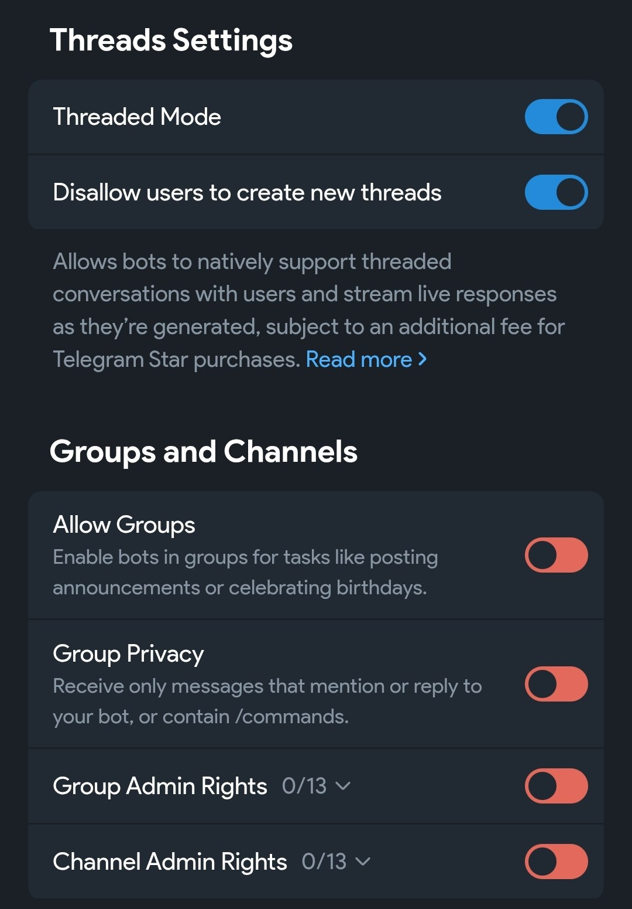

# claude-gram

Telegram-канал для [Claude Code](https://claude.ai/code) — получай и отправляй сообщения, фото, файлы и альбомы прямо из агента. Работает как MCP-сервер поверх stdio, использует [aiogram 3](https://docs.aiogram.dev/).

---

## Возможности

- **Полная поддержка медиа** — текст, фото, аудио, документы и альбомы; все файлы скачиваются и передаются агенту как локальные пути
- **Форум-топики** — каждая сессия Claude Code получает свой тред; при возобновлении (`claudec -c`) бот пишет в тот же топик
- **Запросы разрешений** — запросы прав отображаются как inline-сообщения с кнопками «Разрешить / Отклонить / Подробнее»
- **Авто-разрешение** (`/auto`) — включает автоматическое подтверждение всех запросов
- **Закрытие сессии** (`/close`) — очищает историю, удаляет скачанные файлы, помечает топик закрытым
- **HTML-форматирование** — входящий текст сохраняет разметку Telegram: жирный, курсив, код и т.д.
- **Контекст реплая** — агент видит, на какое сообщение ты ответил
- **Локальный часовой пояс** — временны́е метки в топиках используют твой часовой пояс

---

## Требования

- Python 3.11+
- `aiogram >= 3.28`, `orjson`, `aiosqlite`
- Токен Telegram-бота от [@BotFather](https://t.me/BotFather)

Установка зависимостей:

```bash
pip install aiogram orjson aiosqlite
```

---

## Установка

### 1. Добавь маркетплейс в `~/.claude/settings.json`

```json
{
  "extraKnownMarketplaces": {
    "ripcats-marketplace": {
      "source": {
        "source": "git",
        "url": "https://github.com/ripcats/ripcats-marketplace.git"
      }
    }
  },
  "enabledPlugins": {
    "claude-gram@ripcats-marketplace": true
  }
}
```

### 2. Разреши плагин (managed settings)

Создай `/etc/claude-code/managed-settings.json`:

```json
{
  "channelsEnabled": true,
  "allowedChannelPlugins": [
    { "marketplace": "ripcats-marketplace", "plugin": "claude-gram" }
  ]
}
```

### 3. Создай Telegram-бота

1. Открой [@BotFather](https://t.me/BotFather) в Telegram
2. Отправь `/newbot`, следуй инструкциям
3. Скопируй токен формата `123456789:AAH...`

#### Настройки бота в BotFather

Открой настройки через **BotFather Web App → Bot Settings** и настрой:



- **Threaded Mode** — включить (требуется для форум-топиков в личных чатах)
- **Disallow users to create new threads** — включить (топики создаёт только бот)
- **Allow Groups** — выключить (бот работает только в личных чатах)
- **Group Privacy** — выключить (не нужно)

### 4. Запусти настройку

```bash
claude --channels plugin:claude-gram@ripcats-marketplace
```

Внутри Claude Code выполни:

```
/telegram:init
```

Следуй инструкциям: вставь токен бота, затем отправь `/start` боту — он ответит твоим Telegram ID для завершения настройки.

### 5. Добавь алиас в shell

```bash
# Добавь в ~/.bashrc или ~/.zshrc
alias claudec='claude --channels plugin:claude-gram@ripcats-marketplace'
```

Использование:

```bash
claudec          # новая сессия
claudec -c       # возобновить предыдущую (тот же топик)
```

---

## Команды бота

| Команда | Описание |
|---|---|
| `/start` | Показывает твой Telegram ID (первичная настройка) |
| `/auto` | Включить/выключить авто-разрешение запросов |
| `/close` | Закрыть текущий топик сессии |

---

## Инструменты агента

| Инструмент | Описание |
|---|---|
| `reply` | Отправить текст (plain, Markdown или HTML) |
| `reply_file` | Отправить файлы — один файл или альбом |
| `reactions` | Поставить emoji-реакцию на сообщение |
| `edit_message` | Редактировать ранее отправленное сообщение |
| `get_history` | Получить историю сообщений текущей сессии |
| `rename_thread` | Переименовать форум-топик |

---

## Конфигурация

Состояние хранится в `~/.claude/channels/telegram/`:

```
~/.claude/channels/telegram/
├── .env                  # TELEGRAM_BOT_TOKEN
├── access.json           # настройки доступа
├── session_thread_id     # ID активного форум-топика
├── history.db            # лог сообщений (SQLite)
└── inbox/                # скачанные медиафайлы
```

Поля `access.json`:

| Поле | Описание |
|---|---|
| `allowFrom` | Список разрешённых Telegram ID |
| `ackReaction` | Emoji-реакция на входящие сообщения (по умолчанию `👀`) |
| `tz` | Часовой пояс для топиков, например `Europe/Moscow` |
| `threads` | `false` — отключить форум-топики |

Пример:

```json
{
  "allowFrom": ["123456789"],
  "ackReaction": "👀",
  "tz": "Europe/Moscow"
}
```

---

## Безопасность

- Один пользователь: только ID из `allowFrom` могут взаимодействовать с ботом
- `access.json` изменяется только из терминала, не из Telegram-сообщений
- Токен хранится в `~/.claude/channels/telegram/.env` с правами `600`

---

## Автор

[@ripcats](https://ripcats.t.me)

---

## Лицензия

MIT
